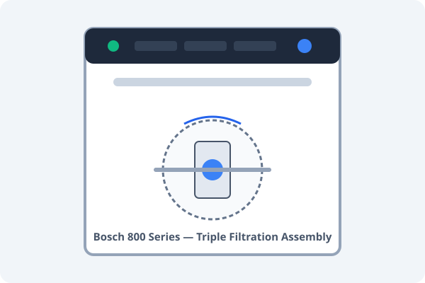

# Dishwasher Guide & Filter Maintenance

> [!NOTE]
> **Model**: Bosch 800 Series (SHX78B75UC)  
> **Salt Type**: Finish Dishwasher Water Softener Salt  
> **Rinse Aid**: Finish Jet-Dry or Somat

---

<figure>
  
  <figcaption>Figure 1: Bottom tub filter assembly. Rotate counter-clockwise 1/4 turn to remove the mesh cylinder.</figcaption>
</figure>

## 🧼 Monthly Filter Cleaning (5 Minutes)

Food particles accumulate in the cylindrical micro-filter at the bottom of the tub.

1. Remove the bottom dish rack completely.
2. Grasp the circular plastic filter handle and **turn 1/4 turn counter-clockwise**.
3. Lift out the cylinder and the flat stainless steel micro-mesh screen.
4. Rinse both under warm running water using a soft dish brush and liquid dish soap.
5. Inspect the sump well for stray seeds, glass, or fruit stickers.
6. Reinstall by aligning the alignment arrows and turning **clockwise until it clicks into place**.

> [!CAUTION]
> Never operate the dishwasher without the filter properly locked in place. Loose food particles can permanently jam the drain impeller.

---

## ⚠️ Troubleshooting Error Codes

### Error E:15 (Water in Base Pan)
- **Cause**: The safety float switch in the bottom tray has detected standing water.
- **Fix**: Turn off circuit breaker in [[household/Emergency Contacts|main panel]], pull unit out gently, tilt backward 45° onto towels to drain the overflow tray, and check door gasket.

### Error E:22 (Filter Blockage)
- Clean the filter assembly as shown in Figure 1 above.

---

## 🔗 Related Notes
- [[household/Emergency Contacts|Emergency Plumber & Breaker Layout]]
- [[guides/Home Maintenance Checklist|Monthly Kitchen Maintenance Checklist]]
