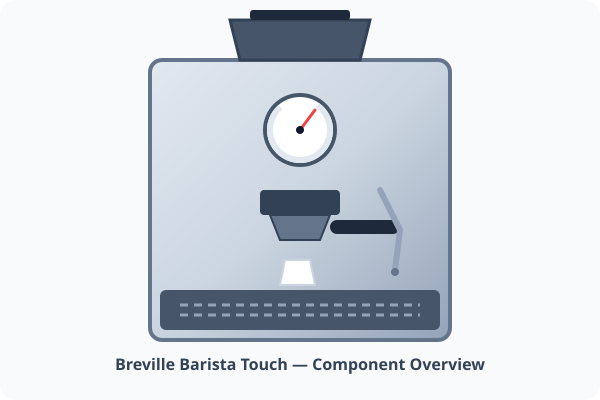

# Espresso Machine Guide & Maintenance

> [!NOTE]
> **Model**: Breville Barista Touch (BES880BSS)  
> **Water Filter**: ClaroSwiss Water Filter (Part #BES008WHT0NUC1)  
> **Location**: Kitchen Coffee Station

---

<figure>
  
  <figcaption>Figure 1: Breville Barista Touch front panel schematic, pressure gauge, and grouphead layout.</figcaption>
</figure>

## ☕ Dial-in Parameters (Daily Recipe)

| Parameter | Medium Roast | Dark Roast | Light Roast |
| :--- | :--- | :--- | :--- |
| **Dose** | 18.5g | 17.5g | 19.0g |
| **Grind Size** | 5 | 7 | 3 |
| **Yield** | 37g (1:2 ratio) | 35g (1:2 ratio) | 45g (1:2.3 ratio) |
| **Extraction Time** | 27 - 30 seconds | 24 - 27 seconds | 30 - 34 seconds |
| **Water Temp** | 93°C (200°F) | 91°C (196°F) | 95°C (204°F) |

> [!TIP]
> Always run a 3-second blank flush through the portafilter before locking in your fresh coffee basket to preheat the shower screen.

---

## 🧼 Routine Maintenance Schedule

### Daily
- Flush grouphead for 5 seconds after knocking out the puck.
- Wipe down steam wand immediately with a damp microfiber cloth and purge for 2 seconds.
- Empty and rinse the drip tray.

### Monthly (Cleaning Cycle)
1. Insert the gray silicone cleaning disk into the single-wall portafilter basket.
2. Place one **Cafiza** cleaning tablet in the center.
3. Lock the portafilter firmly into the group head.
4. Navigate to Settings > `Clean Cycle` and press Start.
5. Rinse water tank thoroughly and pull a sacrificial shot.

> [!WARNING]
> Do NOT use vinegar for descaling. Use dedicated citric acid or Breville Descaling Powder to prevent corrosion of the aluminum thermoblock.

---

## 🔗 Related Notes
- [[household/Emergency Contacts|Plumber & Appliance Repair Contacts]]
- [[household/WiFi and Network|Kitchen IoT Devices]]
- [[recipes/Sourdough Bread|Morning Baking & Espresso Pairing]]
