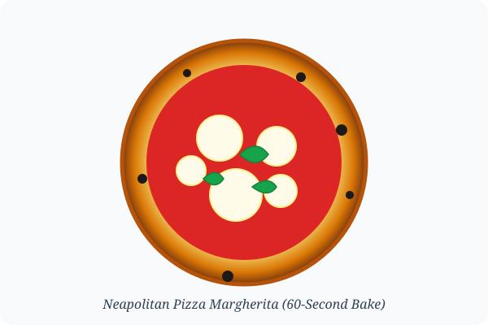

# Authentic Neapolitan Pizza Margherita

> [!NOTE]
> **Oven**: Outdoor Pizza Oven (Roccbox / Ooni at 900°F) or Home Oven with Baking Steel at 550°F  
> **Hydration**: 65% - 70%  
> **Fermentation**: 24-48 hours cold fermentation

---

<figure>
  
  <figcaption>Figure 1: Pizza Margherita with leopard-spotted cornicione, San Marzano sauce, fresh fior di latte, and basil.</figcaption>
</figure>

## 🍕 Dough Ingredients (4 Pizzas @ 260g each)

- **Caputo 00 Pizzeria Flour**: 620g (100%)
- **Cold Water**: 415g (67%)
- **Fine Sea Salt**: 18g (2.9%)
- **Fresh Yeast** (or [[recipes/Sourdough Bread|Sourdough Discard]]): 1.5g instant dry yeast (or 50g starter)

---

## 🍅 Toppings Master Formula
- **San Marzano D.O.P. Whole Tomatoes**: Hand crushed with 1% sea salt and a drizzle of extra virgin olive oil.
- **Fresh Mozzarella / Fior di Latte**: Sliced and drained in a colander for 2 hours to eliminate excess moisture.
- **Fresh Genovese Basil Leaves**: Added fresh right after baking or tucked under cheese before the bake.
- **Pecorino Romano**: Finely grated dusting over sauce.

> [!TIP]
> Keep your wooden peel lightly dusted with semolina (not regular flour) to prevent sticking when launching into the scorching oven!

---

## 🔗 Related Notes
- [[recipes/Sourdough Bread|Sourdough Master Loaf]]
- [[recipes/Pasta Carbonara|Italian Classics]]
