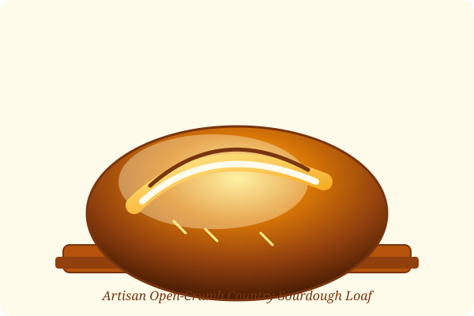

# Master Country Sourdough Loaf

> [!NOTE]
> **Yield**: 2 Loaves (approx. 900g each)  
> **Hydration**: 75%  
> **Fermentation**: 4-5 hours bulk at 78°F, 14-16 hours cold retard at 38°F

---

<figure>
  
  <figcaption>Figure 1: Golden-brown sourdough boule with blistered crust and pronounced expansion ear.</figcaption>
</figure>

## 🌾 Baker's Formula (Percentages)

| Ingredient | Weight (g) | Baker's % | Notes |
| :--- | :--- | :--- | :--- |
| **Bread Flour (Unbleached)** | 800g | 80% | King Arthur High Gluten or Bread Flour |
| **Whole Wheat Flour** | 200g | 20% | Fresh stone-ground wheat |
| **Water (Warm, 85°F)** | 750g | 75% | Filtered |
| **Active Sourdough Starter** | 200g | 20% | Fed 1:1:1 4-6 hours prior at peak |
| **Fine Sea Salt** | 20g | 2% | Non-iodized |

---

## ⏱️ Step-by-Step Schedule

### 1. Autolyse (9:00 AM)
Mix 800g bread flour, 200g whole wheat flour, and 700g water (hold back 50g). Rest covered for 45 minutes to initiate enzymatic breakdown and gluten development.

### 2. Inoculation & Salt (9:45 AM)
Dimple 200g active sourdough starter and 20g fine sea salt dissolved in remaining 50g warm water into the dough. Perform Rubaud kneading for 5 minutes.

### 3. Bulk Fermentation & Folds (10:30 AM – 3:00 PM)
- Perform 3 sets of stretch-and-folds spaced 30 minutes apart.
- Perform 2 sets of gentle coil folds spaced 45 minutes apart.
- Rest until dough has expanded roughly 40-50% in volume with rounded dome edges.

### 4. Shaping & Cold Retard (3:30 PM)
Preshape into rounds, bench rest for 20 minutes, shape into tight batards or boules, and place into rice-flour-dusted bannetons. Transfer into refrigerator for 14-16 hours.

### 5. Baking in Dutch Oven (Next Morning, 8:00 AM)
1. Preheat cast-iron Dutch oven at 500°F (260°C) for 60 minutes.
2. Score loaf with razor blade at a 30° angle.
3. Drop in 2 ice cubes under the parchment paper for steam boost.
4. Bake **20 minutes with lid ON** at 475°F.
5. Remove lid and bake **22-25 minutes with lid OFF** at 450°F until dark mahogany.

> [!TIP]
> Enjoy a fresh warm slice alongside a rich double espresso brewed via [[appliances/Espresso Machine|Coffee Station]]. Extra active starter discard can be saved to make [[recipes/Neapolitan Pizza|Neapolitan Pizza Crust]]!

---

## 🔗 Related Notes
- [[appliances/Espresso Machine|Morning Routine]]
- [[recipes/Neapolitan Pizza|Pizza Dough using Sourdough Discard]]
